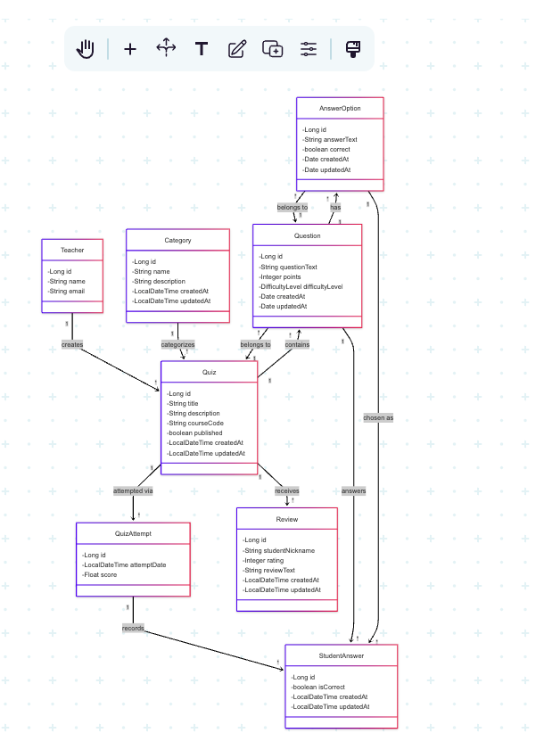

# Software
Development Project

## Table of Contents
- [Introduction](#introduction)
- [Features](#features)
- [Class-Diagram](#class-diagram)
- [Installation](#installation)
- [Usage](#usage)
- [Contributing](#contributing)
- [Authors](#authors)


## Introduction
This project is a collaborative software development effort aimed at solving real-world problems with innovative solutions. It is designed to be user-friendly, efficient, and scalable.

## Features
- Feature 1: Description of the first feature.
- Feature 2: Description of the second feature.
- Feature 3: Description of the third feature.

## Class-Diagram


## Installation
To install and run the project locally, follow these steps:
1. Clone the repository:
    ```bash
    git clone https://github.com/ayushghimire/software-development-project-1.git
    ```
2. Navigate to the project directory:
    ```bash
    cd software-development-project-1
    ```


## Usage
Provide instructions on how to use the application, including examples if applicable.

## Contributing
We welcome contributions! Please follow these steps:
1. Fork the repository.
2. Create a new branch:
    ```bash
    git checkout -b feature-name
    ```
3. Commit your changes:
    ```bash
    git commit -m "Add feature-name"
    ```
4. Push to the branch:
    ```bash
    git push origin feature-name
    ```
5. Open a pull request.

## Authors
- Ayush Ghimire
- Bidhan Adhikari
- Tobi
- Ahmad Jalal

<<<<<<< HEAD

## Team Members
👨‍💻 Member 1 - Backend 
👩‍💻 Member 2 - Backend + Front End
👨‍💻 Member 3 - API & Testing 
👨‍💻Member 4 - Documentation & CI/CD 

=======
## Github Links of Authors
- Ayush Ghimire: https://github.com/ayushghimiresharma95
- Bidhan Adhikari: https://github.com/Bidhan33
- Tobi: https://github.com/tu-nguyen-do-duc
- Ahmad Jalal: https://github.com/Jalalians99
>>>>>>> 0c1ef5de7e98252c35357ff9bd03bc9c6e0e221f

## Link to flinga
https://edu.flinga.fi/s/ECLZ4KQ

## License
This project is licensed under the MIT License. See the [LICENSE](LICENSE) file for details.


